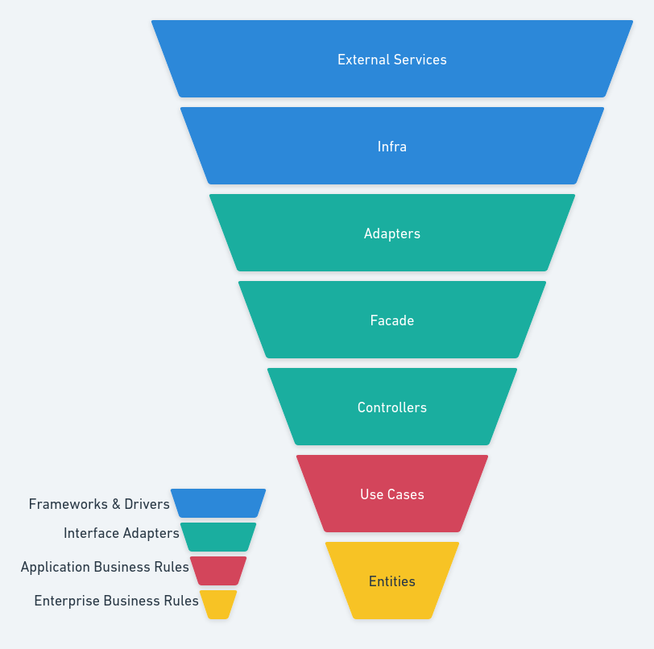

# Bank Aggregation Problem

This problem consists on aggregate multiple bank account data and display the data in a well structured way. The `src/services/` folder content is an Typescript adaption from the Java skeleton developed by Par Renyard on 5/12/21.

There are two external services simulating two different bank APIs, with different organization and available methods.

Along the clean architecture implemented here to solve this problem, I choose two design patterns: Adapters and Facade.

### Adapters

Aiming to invert the dependencies with the external services, a sublayer of adapters was implemented. Each adapter correspond to one bank service, and implements an interface that dictates which methods should be available to the application. With this approach, any other external service that could become part of the aggregation should have an adapter to use them and implement the interface methods.

### Facade

The facade points to the application itself. This was the approach implemented to turn possible the use cases to call the adapters interface methods. Here it is the aggregation. By implementing the adapters interface methods, the lower layers can access those methods, and bring data to the use cases, manipulate them if it's needed and then send them to the controllers, which's responsible for sending the final response. Even being possible to aggregate the data directly in the use cases, the main reason to implement a facade was to turn possible to choose what data should be present in each facade method. For example, if the application must to update the transactions retrieving method to display only specific bank account transactions, it is possible to do it just by doing a brief adjust in this facade method, without affect the other methods, and without a hacky "if-else" way.

--

So with the data retrieved from all external services by the adapters and aggregated by the facade, a controller is able to receive a request from the client and create a new use case instance, injecting the dependency to this lower layer: a facade instance.

The use case will manipulated as needed the data to display a list of transactions with its amount, text, type and bank account origin, along the currencies and total balance grouped by currency.

## Architecture

You can see the folders organization by layers in this diagram:


## Running the application

You will need the [Docker](https://www.docker.com/) on your machine.

In the root of this project, run:

```
docker build -t bank-aggregation .
```

```
docker run -it -p <EXTERNAL_PORT>:3009 -e PORT=3009 bank-aggregation
```

## Usage

Sending a GET request to

```
http://localhost:<EXTERNAL_PORT>/
```

you will see all the data retrieved from the services.

Sending a GET requst to

```
http://localhost:<EXTERNAL_PORT>/health-check
```

you can check the service is running.
